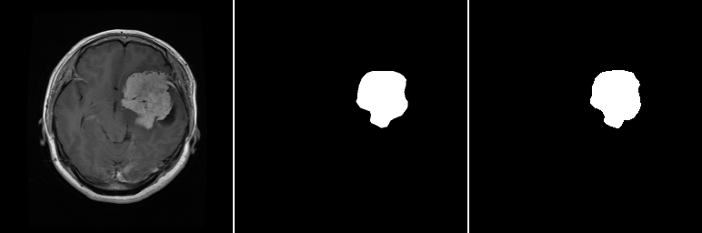
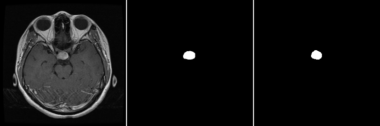
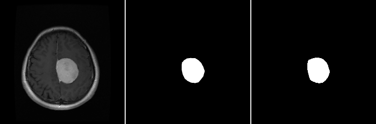
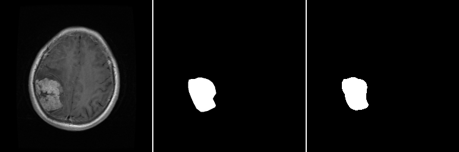

# MRI-tumor-segmentation
This repository aims to build a deep learning-based MRI tumor segmentation model using Tensorflow (utilized with UNET).

Dataset source:
https://figshare.com/articles/dataset/brain_tumor_dataset/1512427

## 🚀 Getting Started
1. Clone this repository:
   ```bash
   git clone https://github.com/AidasBat/MRI-tumor-segmentation.git
   ```
2. Install dependencies
   ```bash
   pip install -r requirements.txt
   ```
4. Open Jupyter Notebook
   ```bash
   jupyter notebook
   ```

# Results example
The images below contains:  

`              Input image                       Ground truth                      Predicted mask          `

|  |
| :--: |
|  |
|  |
|  |
